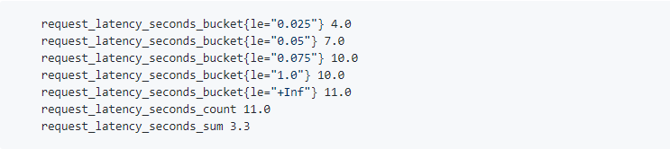

# Concepts
<!-- TOC -->

- [Concepts](#concepts)
  - [Data Model](#data-model)
  - [Metric type](#metric-type)
    - [Counter](#counter)
    - [Gauge](#gauge)
    - [Histogram :](#histogram-)
    - [Summary](#summary)
  - [Job và Instance](#job-và-instance)

<!-- /TOC -->

## [Data Model](https://prometheus.io/docs/concepts/data_model/)


Prometheus về cơ bản lưu trữ tất cả dữ liệu theo cấu trúc cơ sở dữ liệu chuỗi thời gian (TSDB). Cơ sở dữ liệu chuỗi thời gian (TSDB) là cơ sở dữ liệu được tối ưu hóa cho dữ liệu được đánh dấu thời gian hoặc chuỗi thời gian, dữ liệu chuỗi thời gian chỉ đơn giản là các phép đo hoặc sự kiện được theo dõi, giám sát, lấy mẫu và tổng hợp theo thời gian. Cơ sở dữ liệu chuỗi thời gian có một mô hình dữ liệu rất cụ thể để cho phép nó hoạt động hiệu quả bao gồm các thành phần sau:

**Metric name**: Chỉ ra đặc tính chung của số liệu hệ thống cần đo. Ví dụ: http_requests_total → tổng số yêu cầu HTTP nhận được.

**Label**: Là các cặp khóa (key) - giá trị (value) kết hợp với tên số liệu xác định cho chuỗi thời gian trong Prometheus.
  
Ví dụ: http_requests_total{service="users-directory",instance="1.2.3.4"} → số liệu có 2 nhãn : service="users-directory" và instance="1.2.3.4"
    - Khóa: có thể bao gồm: chữ, số hay dấu gạch dưới “_”.
    - Giá trị: Có thể chứa bất kỳ ký tự Unicode nào.
    - Thay đổi bất kỳ giá trị của nhãn nào, bao gồm thêm hoặc xóa nhãn, sẽ tạo ra chuỗi thời gian mới.

**Sample**: Các mẫu hình thành lên chuỗi thời gian thực tế, mỗi mẫu bao gồm:
    - Một giá trị thực 64 bit (float64)
    - Một mẫu thời gian chính xác đến mili giây.

*_Notation_*

```sh
<metric name>{<label name>=<label value>, ...}
```

## [Metric type](https://prometheus.io/docs/concepts/metric_types/)

Các thông tin về các đối tượng mà các Exporter thu được trước khi được xuất ra để Prometheus thu thập đều được tổng hợp thành một trong bốn kiểu số liệu phù hợp mà Prometheus hỗ trợ.

### Counter

Counter là số liệu tích lũy đại diện cho một bộ đếm chỉ có thể tăng dần hoặc được đặt lại về 0 khi khởi động lại. Counter được sử dụng để ghi lại giá trị chỉ tăng ví dụ như số lượng yêu cầu HTTP được gửi đi đến địa chỉ của một dịch vụ web hay bản tin lỗi gửi đến một interface của thiết bị router,…

### Gauge

Gauge là số liệu đại diện cho một giá trị số có thể tùy ý lên xuống, là "counter" có thể tăng và giảm, thường được sử dụng cho các giá trị đo như nhiệt độ hoặc mức sử dụng bộ nhớ hiện tại.

Ví dụ: Bạn có thể sử dụng bộ đếm để thể hiện số lượng yêu cầu đã hoàn thành hoặc lỗi. Không sử dụng bộ đếm với giá trị có thể giảm như số lượng quy trình hiện đang chạy mà nên sử dụng Gauge.

### Histogram :

Histogram là kết hợp của nhiều counter bao gồm các counter đo tần số của quan sát giá trị rơi vào các nhóm cụ thể, counter đếm tổng số quan sát và counter là tổng giá trị của các quan sát đó. Ví dụ có thể đo thời lượng yêu cầu cho một yêu cầu HTTP cụ thể bằng Histogram thay vì lưu trữ mọi thời lượng cho mỗi yêu cầu, Prometheus sẽ thực hiện xấp xỉ bằng cách lưu trữ tần suất của các yêu cầu rơi vào các bucket cụ thể. Bucket là counter của các quan sát. Nó nên có giới hạn trên và giới hạn dưới.

- `<basename> _bucket {le = "< upper includesive bound >"}` : bộ đếm tích lũy cho các bucket quan sát .
- `<basename> _sum`: tổng cộng của tất cả các giá trị được quan sát.
- `<basename> _count` : số lượng các sự kiện đã được quan sát .(= `<basename>_bucket{le="+Inf"}`)



Histogram về độ trễ của các bản tin yêu cầu theo giây, bao gồm 4 counter đầu tiên là thống kê độ trễ của các bản yêu cầu lần lượt có 4 yêu cầu có độ trễ nhỏ hơn hoặc bằng (le) 0.025 giây, 7 yêu cầu có độ trễ nhỏ hơn 0.05 giây, 10 yêu cầu có độ trễ nhỏ hơn 1 giây, counter biểu diễn yêu cầu có độ trễ nhỏ hơn “+Inf” (dương vô cùng) hay được hiểu rằng có 11 độ trễ của yêu cầu được quan sát bằng với giá trị của số liệu “request_latency_seconds_count” và số liệu cuối cùng là tổng số thời gian trễ 3.3 giây của 11 yêu cầu được quan sát.

Các trường hợp sử dụng Historgram:
- Khi muốn thực hiện nhiều phép đo của một đối tượng, để sau đó tính trung bình hoặc phần trăm .
- Khi không bận tâm về các giá trị chính xác,có thể sử dụng giá trị xấp xỉ .
- Khi biết phạm vi của các giá trị

Ví dụ: Thời hạn yêu cầu, Kích thước phản hồi,...

Sử dụng hàm histogram_quantile () để tính toán lượng tử từ biểu đồ hoặc thậm chí tổng hợp biểu đồ.

A Histogram looks like:

```sh
    request_latency_seconds_bucket{le="0.025"} 4.0
    request_latency_seconds_bucket{le="0.05"} 7.0
    request_latency_seconds_bucket{le="0.075"} 10.0
    request_latency_seconds_bucket{le="1.0"} 10.0
    request_latency_seconds_bucket{le="+Inf"} 11.0
    request_latency_seconds_count 11.0
    request_latency_seconds_sum 3.3

```

### Summary

Summary tương tự như Histogram, nó là kết hợp của một số counter và gauge. Summary lấy mẫu các quan sát (như thời lượng yêu cầu và kích thước phản hồi), mặc dù nó cũng cung cấp tổng số các quan sát và tổng của tất cả các giá trị quan sát, nhưng thay vì thống kê các giá trị rơi vào các nhóm như Histogram nó sẽ tính toán lượng tử (quantiles) có thể của các quan sát.

- `<basename> {quantile = "<φ>"}`:  φ-quantiles (0 ≤ φ≤ 1) các sự kiện được quan sát.
- `<basename> _sum`: tổng cộng của tất cả các giá trị được quan sát.
- `<basename> _count`: số lượng các sự kiện đã được quan sát.

Các trường hợp sử dụng Summary cũng giống như Histogram.

A Summary looks like:

```sh
go_gc_duration_seconds{quantile="0"} 0.000236554
go_gc_duration_seconds{quantile="0.25"} 0.000474629
go_gc_duration_seconds{quantile="0.5"} 0.0005691670000000001
go_gc_duration_seconds{quantile="0.75"} 0.000677597
go_gc_duration_seconds{quantile="1"} 0.002479919
go_gc_duration_seconds_sum 12.532527861
go_gc_duration_seconds_count 24279
```

**_Một số khác biệt giữa Summary và Historgram_**:

- Với Historgram lượng tử được tính trên máy chủ Prometheus, với Summary chúng được tính trên máy chủ ứng dụng . Do đó, dữ liệu Summary không thể được tổng hợp từ một số trường hợp ứng dụng.
- Historgram yêu cầu định nghĩa giá trị trước của bucket , vì vậy phù hợp với trường hợp sử dụng khi có ý tưởng tốt về sự tràn dải của các giá trị.
- Summary là một lựa chọn tốt nếu cần tính toán các lượng tử chính xác, nhưng không thể chắc chắn phạm vi của các giá trị sẽ là bao nhiêu.

## [Job và Instance](https://prometheus.io/docs/concepts/jobs_instances/)

- Instance: một endpoint mà Prometheus có thể thu thập dữ liệu metrics, tương ứng với một single process.
- Job: tập hợp các instance có chung mục đích.

Ví dụ:

- job:  `api-server`
  - instance 1:  `1.2.3.4:5670`
  - instance 2:  `1.2.3.4:5671`
  - instance 3:  `5.6.7.8:5670`
  - instance 4:  `5.6.7.8:5671`
